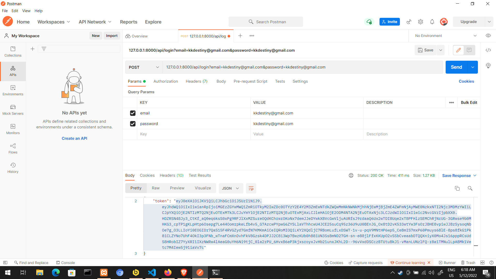
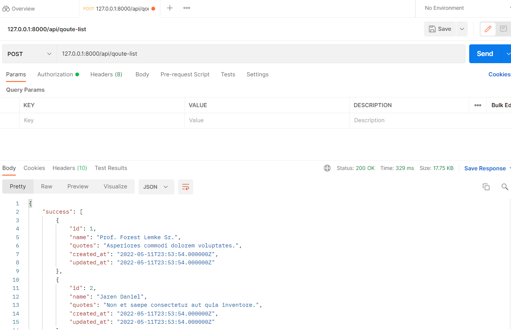
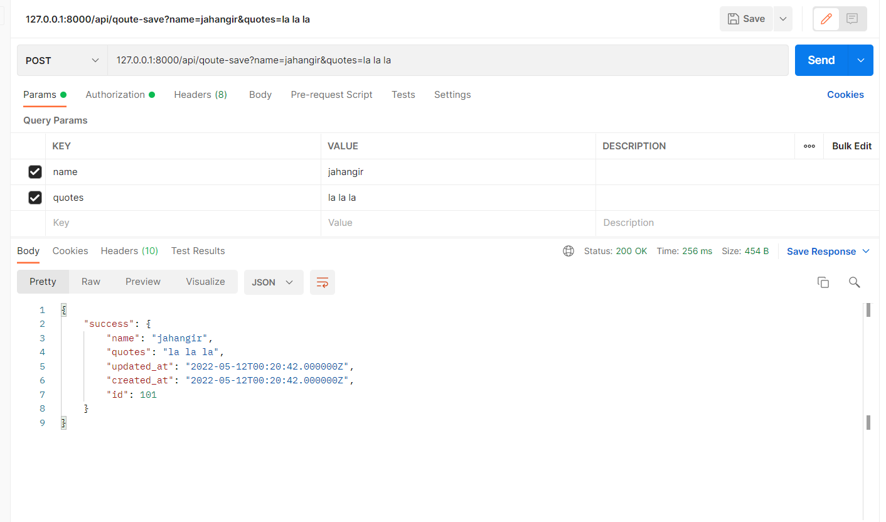

# Qoute Gen

### Features
- shows random Quotes of Famous Persons.
- Can  Refresh Button to show 5 random Quotes each time (on the same page without reloading).
- There is Text Input field to Search the Quotes with Keywords (on the same page without reloading).
- These Quotes can be added/edited/deleted from Admin Panel.
- Authentication for this page should be done with a user name & password.
- Two API endpoints created.
- The API route is secured with a token (optional).
- Above features are tested with Feature tests (optional).
- Above features are tested with Unit tests (optional).

#### Bounded with short amount of time i couldn't  create reponsive / eye catching UI :smile:
## Installation

1. Checkout the repository:

```
git@github.com:cloudy4next/Qoute-gen.git
```

2. Copy Env file & Generate Key 
```
cp .env.example .env
php artisan key:generate

```
3. Run migration: 
```
php artisan migrate
```
4. Run seeder
``` 
php artisan db:seed 
```
5. Install composer dependencies: 

```
composer install
```

6. Install Passport for Tesing api: 

```
php artisan passport:install
```
7. Start the built-in webserver (or use Apache/Nginix): 

```
php artisan serve
```

8. Browse and use ```kkdestiny@gmail.com``` as gmail and password: http://127.0.0.1:8000


## POSTMAN Api Testing 

1. Set Username and password 


Copy token and add it to ``Bearer Token``.

2. Make request as showed to see following result:


3. Make request as showed to see following result:



## Unit Testing and Feature Testing
```
php artisan test

./vendor/bin/phpunit
```
